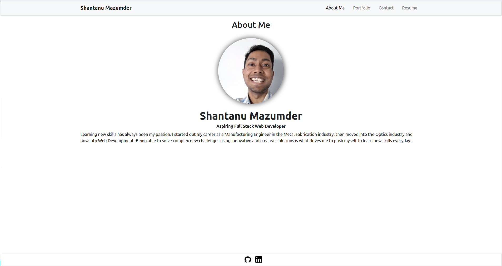

# Portfolio
  


## Description
The purpose of this site is to show case the technical skills and the knowledge of Shantanu Mazumder as a Full Stack Web Developer. The site includes a brief bio about him, as well as links to some of his notable projects, their deployed links and their corresponding Github repositories. This will allow for a potential employer to view and evaluate his quality of work for themselves.

## Table of Contents
* [Installation](#installation)
* [Usage](#usage)
* [License](#license)
* [Contributing](#contributing)
* [Tests](#tests)
* [Questions](#questions)

## Installation
To install this application run ```npm i```. This will install all the necessary packages.

## Usage
To start the application locally, type ```npm start``` in the terminal from the root of the project file.  



## License
This application is available under the GNU General Public License family license.


## Contributing
Currently there is no way to contribute to this project.

## Tests
All the components in the project has tests associated with them. The tests utilize Jest testing framework. To run the tests type ```npm run test```.

## Questions
For any questions about the project, please don't hesitate to reach out.
* Link to my Github page : [ShawnMaz](https://github.com/ShawnMaz)
* Email: [shawn_maz@pm.me](mailto:shawn_maz@pm.me)